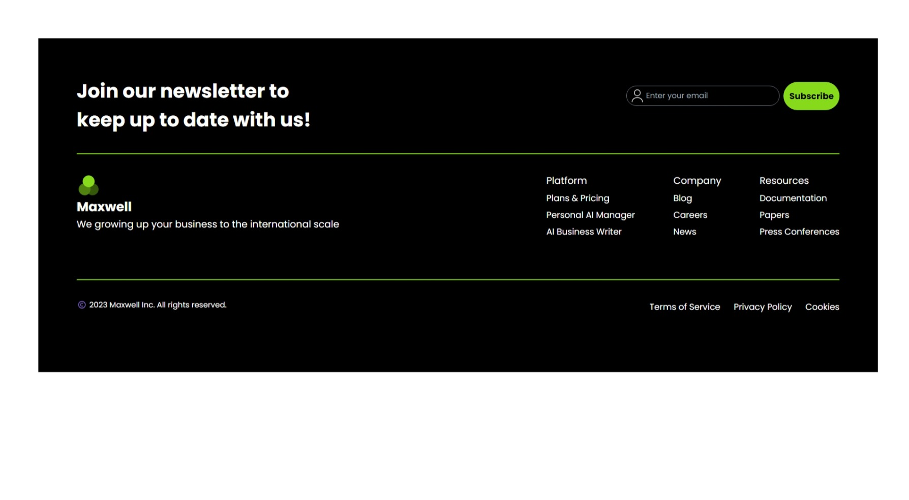

## ESP:

# Proyecto 12 - Footer Dark (Responsive)

Maquetación de un ejemplar de footer en HTML, CSS, Astro y Tailwind

## 🎯 Objetivo del Proyecto

El objetivo de este proyecto es aplicar todo lo aprendido en HTML, CSS, Astro y Tailwind

## 👁️ Vista previa del proyecto



## 🛠️ Estructura del Proyecto

El proyecto está organizado por componentes. Cada componente es utilizado en el index.astro


## 🚀 Funcionalidades y uso

Podrás usar la página pinchando en el siguiente enlace gracias a Github Pages:

https://kaeedev.github.io/Proyecto-13-Footer-Dark/

## 🛠️ Instalación y Ejecución

1. Clona este repositorio:
   ```bash
   https://github.com/kaeedev/Proyecto-13-Footer-Dark.git

2. No requiere de instalación. Con la extensión live server o similares de VSCODE podrás ver el proyecto de manera local

## 📝 Licencia

Este proyecto está disponible únicamente para uso **docente** y con fines de aprendizaje.

### Condiciones:
- El código fuente de este proyecto puede ser usado, modificado y distribuido solo con fines educativos.

Si tienes alguna duda o quieres utilizar algún recurso de este proyecto, por favor contacta conmigo.

---

## ENG:

# Project 12 - Footers Lights (Responsive)

Layout of a online forum made with HTML, CSS, Astro, and Tailwind

## 🎯 Project Objective

The goal of this project is to apply everything learned in HTML, CSS, Astro, and Tailwind.

## 👁️ Project Preview


## 🛠️ Project Structure

Layout of one example of footers using HTML, CSS, Astro, and Tailwind

## 🚀 Features and Usage

You can access the page by clicking the following link, thanks to GitHub Pages:

https://kaeedev.github.io/Proyecto-13-Footer-Dark/

## 🛠️ Installation and Execution
Clone this repository:
  ```bash
  https://github.com/kaeedev/Proyecto-13-Footer-Dark.git
  ```

No installation is required. You can view the project locally using the Live Server extension or similar tools in VSCode.

## 📝 License
This project is available solely for educational purposes and learning.

Conditions:
The source code of this project can be used, modified, and distributed only for educational purposes.
If you have any questions or want to use any resource from this project, please contact me.
